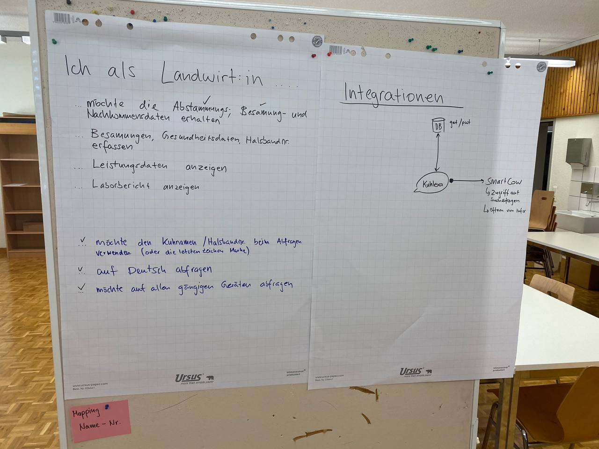
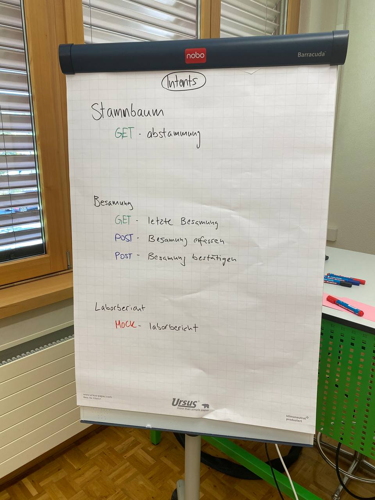

# 01_Kuhlexa
# Pitch

## Ausganglage
Wie wäre es, wenn der Bauer im Stall, während dem Melken oder bei der Tierbeobachtung, über einen Sprachassistent Information bekommen, Daten erfassen oder Aktionen auslösen könnte? Sprechen statt Tippen! Digitale Sprachassistenten wie Amazons Alexa, Googles Assistant oder Siri von Apple werden von Jahr zu Jahr beliebter und immer mehr Verbraucher nutzen den Komfort von Sprachassistenten. Digitale Assistenten werden immer beliebter und können in Zukunft auch den Landwirten im Stall oder auf dem Betrieb unterstützen.

## Ziel
Das Ziel ist es eine Sprachassistent-App zu entwickeln, welcher der Bauer bei seinen täglichen Arbeiten unterstützt.

## Infos/Daten
[https://7-test6.d.qualitasag.ch/webservice-datenverbund/#/](https://7-test6.d.qualitasag.ch/webservice-datenverbund/#/)(Proprietärer WS der Zuchtverbände)
[https://dialogflow.cloud.google.com/ ](https://dialogflow.cloud.google.com/ )(Plattform zum Verständnis natürlicher Sprache)

# Zugänge
[Dialogflow Projekt](https://dialogflow.cloud.google.com/#/editAgent/kuhlexa-oxnr/)

# Prozess
## User Stories
Ich als Landwirt:in...

...möchte die Abstammungs, Besamungs- und Nachkommensdaten meiner Kuh abfragen.

...möchte Besamungen, Gesundheitsdaten und Halsbandnummer erfassen.

...Leistungsdaten anzeigen lassen.

...Laborberichte anzeigen lassen.

...möchte den Kuhnamen, Halsbandnummer, oder die 4 eindeutigen Ziffern der Markennummer zum Abfragen verwenden.

...auf Deutsch abfragen machen.

...Abfragen von allen gängigen Geräten tätigen.

## Impediments

* Keine direkte Abfrage zwischen Markennummer und Kuhname / Halsbandnummer.
--> Wurde gelöst mittels Mapping Tabelle :-)

## let's get to work
Impressionen:

User Stories und das Big Picture ausgearbeitet.

Unsere REST Requests aufgezeichnet.

Hier sind wir etwa nicht am herumsurfen am Handy sondern am sprechen mit unserer Kuhlexa!